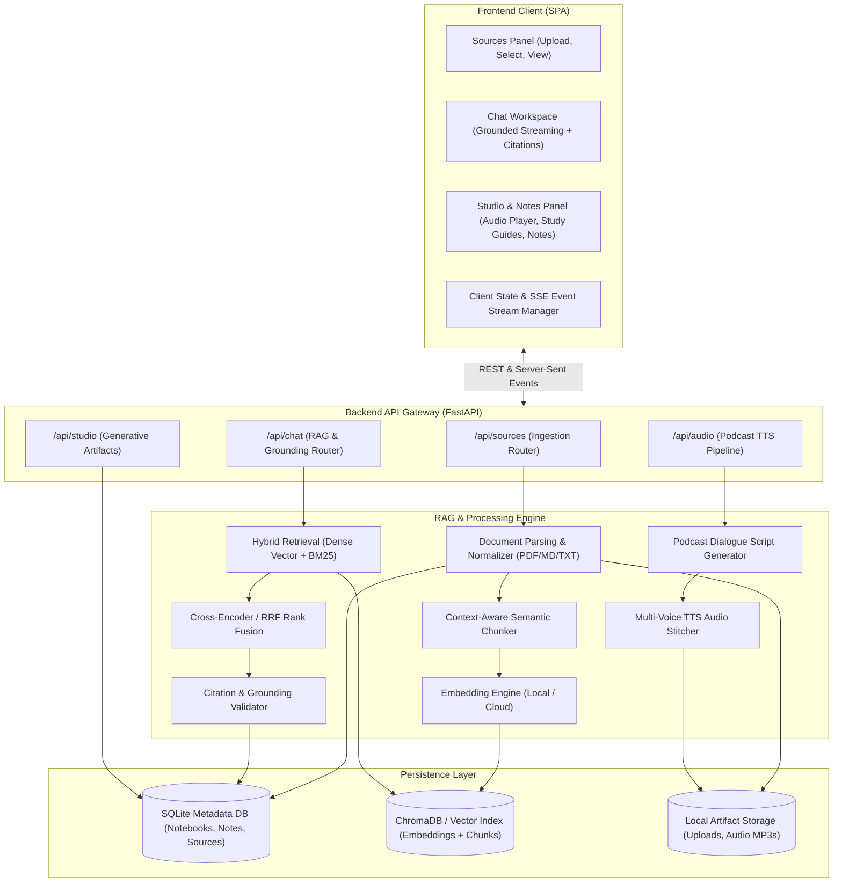
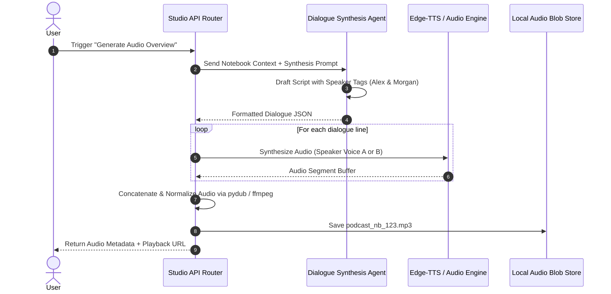
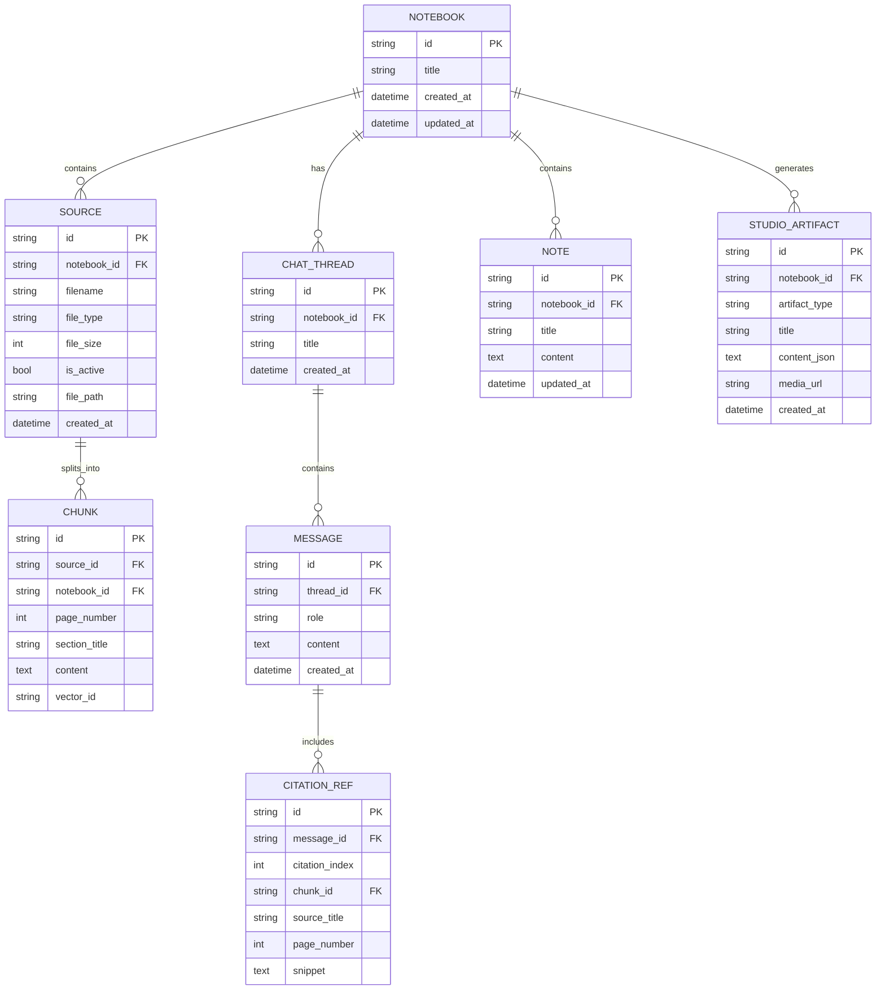

# System Architecture Document (ARCHITECTURE.md)
## Project: NotebookLM-lite

---

## 1. Architectural Overview

NotebookLM-lite is built as a **modular, local-first client-server application** optimized for high-faithfulness document comprehension, interactive grounding, and multi-modal generative synthesis.



---

## 2. Ingestion & Preprocessing Pipeline

### 2.1 File Extraction Layer
- **PDF Engine**: PyMuPDF (`fitz`) or `pypdf` extracts text blocks alongside exact bounding coordinates and page numbers (`page_idx`).
- **Markdown / Plain Text**: Native token-preserving parsers preserving heading hierarchies (`#`, `##`, `###`) as semantic boundary markers.
- **DOCX / HTML**: Clean text extraction stripping redundant formatting while retaining structure.

### 2.2 Semantic Chunking Strategy
- **Chunk Size**: Standard default of 512 tokens (~1800 characters) with a 64-token sliding window overlap to preserve sentence boundaries.
- **Header-Aware Chunking**: Markdown documents split by section headers first, then subdivided recursively if chunk limits are exceeded.
- **Chunk Metadata Schema**:
  ```json
  {
    "chunk_id": "chk_8f93a1c2",
    "notebook_id": "nb_default",
    "source_id": "src_4b2e88a0",
    "source_name": "Attention_Is_All_You_Need.pdf",
    "page_number": 3,
    "section_title": "3.2 Multi-Head Attention",
    "char_start": 4120,
    "char_end": 5600,
    "token_count": 482,
    "sha256": "e3b0c44298fc1c149afbf4c8996fb92427ae41e4649b934ca495991b7852b855"
  }
  ```

---

## 3. Retrieval & Grounding Architecture

### 3.1 Hybrid Search with Reciprocal Rank Fusion (RRF)
To combat the weakness of vector-only search (poor exact keyword matching) and BM25-only search (semantic blindness), NotebookLM-lite implements a 2-stage hybrid retrieval strategy:

1. **Stage 1A (Dense Retrieval)**:
   - Query embedded via dense vector model (`text-embedding-3-small` or local `bge-small-en-v1.5`).
   - Cosine similarity k-NN query on ChromaDB filtered by `notebook_id` and `active_source_ids`.
2. **Stage 1B (Sparse Retrieval)**:
   - Query tokenized and scored across BM25 index on chunk text.
3. **Stage 2 (Reciprocal Rank Fusion)**:
   $$\text{RRF Score}(d) = \sum_{m \in \{dense, sparse\}} \frac{1}{k + \text{rank}_m(d)}$$ (with constant $k = 60$).
4. **Stage 3 (Top-k Selection & Context Formatting)**:
   - Top 5–8 chunks selected.
   - Formatted into an indexed prompt structure with unambiguous source anchors.

### 3.2 Grounded Context Assembly & Citation Injection
The prompt explicitly binds each context block to a canonical citation index:

```text
You are NotebookLM-lite, a meticulous research assistant.
Answer the user's prompt STRICTLY using the provided sources below.
Rules:
1. Every factual statement must cite its source using [1], [2], etc.
2. If the context does not contain sufficient information, explicitly state: "The provided sources do not mention this."
3. Never use outside training knowledge to fill gaps.

--- SOURCES BEGIN ---
[Source 1]: "Attention Is All You Need.pdf" (Page 3)
"Multi-head attention allows the model to jointly attend to information from different representation subspaces..."

[Source 2]: "Transformer_Survey.md" (Section: Overview)
"The transformer replaces recurrent units entirely with self-attention..."
--- SOURCES END ---
```

---

## 4. Audio Overview (Podcast Deep Dive) Architecture

The Audio Overview mimics Google NotebookLM’s viral two-host podcast feature:



### 4.1 Host Personas
- **Speaker A (Alex - Deep & Analytical)**: Grounded expert who synthesizes core insights, provides technical clarity, and introduces topics.
- **Speaker B (Morgan - Curious & Energetic)**: Engaged co-host who asks clarifying questions, introduces relatable metaphors, and challenges assumptions.

### 4.2 Script Format Schema
```json
[
  {
    "speaker": "Alex",
    "voice_id": "en-US-GuyNeural",
    "text": "Welcome back! Today we are looking into a fascinating paper uploaded to the notebook..."
  },
  {
    "speaker": "Morgan",
    "voice_id": "en-US-JennyNeural",
    "text": "Right, and what caught my eye immediately is how they completely threw out recurrence!"
  }
]
```

---

## 5. Data Models & Database Schema

The metadata layer is managed via an embedded SQLite database using SQLAlchemy or SQLModel:



---

## 6. Frontend State & Component Hierarchy

### 6.1 Layout Triad
```text
+-----------------------------------------------------------------------------------------+
| Top Navigation Bar: Notebook Title | LLM Provider Selector | Settings | Export          |
+-----------------------------------------------------------------------------------------+
| [SOURCES PANEL]           | [GROUNDED CHAT WORKSPACE]       | [STUDIO & NOTES PANEL]    |
| (300px - collapsible)     | (Flex: 1)                       | (380px - collapsible)     |
|                           |                                 |                           |
| + Add Sources (+ Upload)  | [Chat Stream]                   | + Audio Overview Player   |
|   - PDF / Docx / Text     | User: What is the main thesis?  |   [Play] [01:24 / 04:15]  |
|                           |                                 |   Waveform Visualizer     |
| [X] Paper_1.pdf (p.1-12)  | Assistant:                      |                           |
| [X] Notes_summary.md      | The primary thesis argues that  | + Generate Studio Guides: |
| [ ] Draft_spec.docx       | attention mechanisms [1] are... |   - Study Guide [Gen]     |
|                           |                                 |   - Briefing Doc [Gen]    |
| [Source Details Preview]  | [1] Popup: "Page 3: Attention   |   - FAQ / Glossary [Gen]  |
|                           |      is all you need..."        |                           |
|                           |                                 | + My Notes (Scratchpad):  |
|                           | [Input: Ask a question...  ->]  |   - Key Takeaways (Draft) |
+-----------------------------------------------------------------------------------------+
```

### 6.2 Frontend Technology Details
- **Framework**: Vite + React 18 / Next.js with TypeScript for compile-time safety.
- **Styling**: Vanilla CSS Modules with semantic CSS custom properties (`--bg-primary`, `--accent-brand`, `--surface-elevated`).
- **Icons**: Lucide React.
- **Markdown & Math**: `markdown-it` with `katex` for mathematical formulas and LaTeX rendering.
- **Audio Synthesis Component**: HTML5 Web Audio API with canvas-based audio spectrum / waveform visualizer.

---

## 7. Security, Privacy & Extensibility

1. **Local-First Processing**: Documents never leave the user's host machine unless a cloud LLM is chosen. With Ollama, the entire pipeline is 100% offline.
2. **Provider Swapping**: Abstracted `LLMProvider` interface allows swapping between OpenAI (`gpt-4o-mini`), Google Gemini (`gemini-1.5-flash`), Anthropic (`claude-3-5-sonnet`), and local Ollama (`llama3.2`, `mistral`).
3. **CORS & Network Isolation**: Backend strictly binds to `127.0.0.1` by default to prevent unauthorized network exposure.
